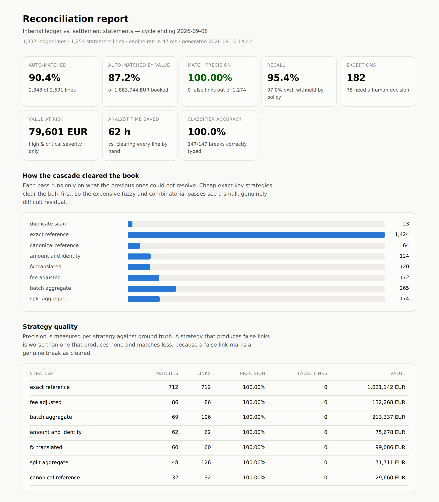
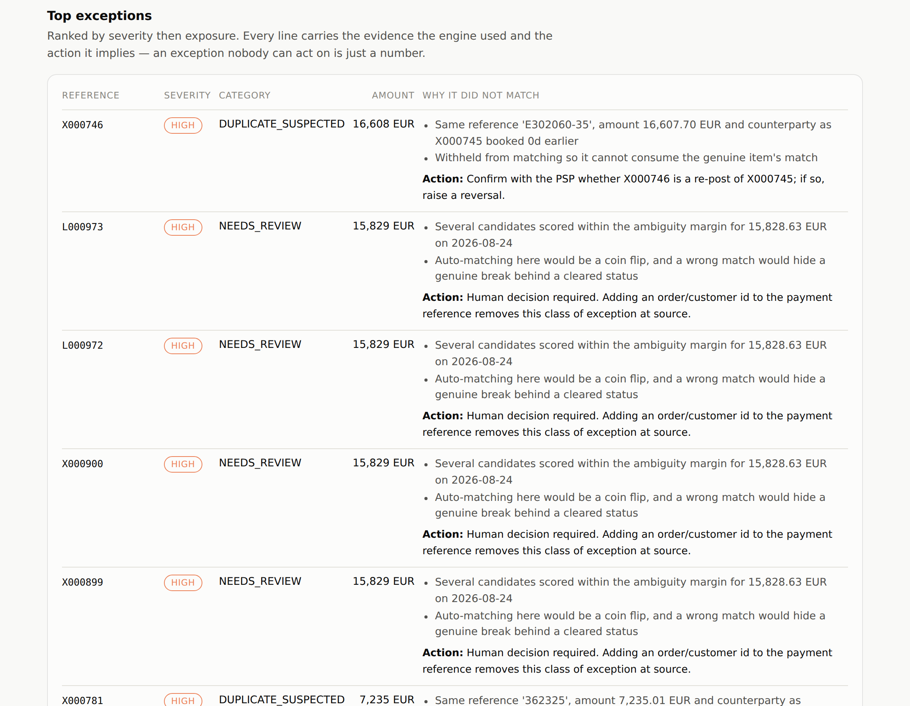

# recon-engine

**Transaction reconciliation with explainable break classification — graded against ground truth, not eyeballed.**

[](https://github.com/matmat174/recon-engine/actions/workflows/ci.yml)


Every payments business runs the same loop every morning: take what the internal
ledger says happened, take what the PSP or bank statement says actually settled,
and find the differences. It is the highest-volume manual task in a back office,
and the reason it stays manual is that the two sides rarely agree exactly —
settlement lands two days late, the PSP nets its fee at source, twelve invoices
arrive as one payout, and SWIFT has quietly truncated the payment reference.

This engine clears that book automatically, and — the part that actually
matters — it says *why* it did or did not clear each line.

```
  Reconciliation summary
  ----------------------------------------------------------
  lines processed                 2,591   (47 ms)
  auto-matched                  90.43%   (2,343 lines)
  auto-matched by value         87.21%
  precision                  100.0000%   (0 false links)  OK
  recall                        95.36%   (97.03% excl. policy-withheld)
  break classification         100.00%   (147/147)
  exceptions                        147
  needs human review                 78
  value at risk                  79,601 EUR
  analyst time saved                 62 h
```



## Results

Measured over **25 independently generated books, 63,377 lines, 31,010 links created**.
Reproduce with `make bench`; the same gate runs in CI on every push.

| Metric | Mean | Range | What it means |
|---|---|---|---|
| Auto-match rate | **90.98%** | 89.84 – 92.37% | Share of lines cleared with no human involvement |
| **Precision** | **100.0000%** | 100 – 100% | **0 false links in 31,010.** No genuine break was ever marked cleared |
| Recall | 96.25% | 94.88 – 98.13% | Share of true links the engine found |
| Break classification | 99.97% | 99.34 – 100% | Share of exceptions given the correct root cause |
| Throughput | ~52,000 lines/s | — | Single-threaded, pure standard library |

Precision is the headline, not the auto-match rate. Auto-match rate can be
driven to 100% by matching everything to anything; precision is what stops the
engine from doing that. **A false match is not a small error — it removes a real
break from the exception queue and stamps it cleared, so nobody ever looks at
it again.** The engine is tuned accordingly: when two candidates are within an
ambiguity margin of each other, it refuses to guess and escalates instead.

## Quickstart

No dependencies, no install, no network.

```bash
git clone https://github.com/matmat174/recon-engine && cd recon-engine
PYTHONPATH=src python3 -m recon demo      # -> docs/report.html
```

That generates a book of ~2,600 transactions with known ground truth,
reconciles it, grades itself, and writes a self-contained HTML report. Then:

```bash
make test     # 58 tests, including the invariants below
make bench    # 25 books, metric spread, CI quality gate
make export   # write the synthetic book to data/*.csv to inspect it
```

To run it on real extracts:

```bash
PYTHONPATH=src python3 -m recon run \
  --ledger ledger.csv --external statement.csv --out report.html
```

The CSV contract is `txn_id, booking_date, amount, currency, counterparty,
reference` plus optional `method`. Amounts are parsed straight to `Decimal`
from the raw string — `1 234,56`, `1,234.56` and `(99.00)` all work, and no
amount ever passes through a float.

## How it works

Seven strategies run as a cascade. Each one sees only what the previous ones
could not resolve, so the cheap exact-key passes clear the bulk and the
expensive fuzzy and combinatorial passes get a small, genuinely difficult
residual. On the demo book, `exact_reference` alone clears 55% of all lines in
7 ms, which is what leaves the six harder passes a workable budget inside the
47 ms total.

| Pass | Resolves | Key idea |
|---|---|---|
| `duplicate_scan` | Double-posted statement lines | Runs *before* matching, so a duplicate cannot steal the genuine item's match |
| `exact_reference` | Clean settlements | Reference + amount + currency, exact |
| `canonical_reference` | Mangled references | `PMT/INV-0000442` and `REF 442` normalise to the same key |
| `amount_and_identity` | Late settlement, corrupted references | Bucket on exact amount, then decide identity fuzzily |
| `fx_translated` | Cross-currency settlement | Convert at ECB reference rates, allow 35 bps of drift |
| `fee_adjusted` | Fees netted at source | Shortfall must fit a fee envelope that scales with ticket size |
| `batch_aggregate` / `split_aggregate` | N:1 payouts, 1:M instalments | Bounded subset-sum over a directional date window |

Whatever survives is classified rather than dumped in an "unmatched" bucket:
`NOT_SETTLED`, `IN_TRANSIT`, `UNIDENTIFIED_RECEIPT`, `AMOUNT_MISMATCH`,
`FX_RATE_DISPUTE`, `DUPLICATE_SUSPECTED`, `LATE_SETTLEMENT`, `NEEDS_REVIEW` —
each with the evidence the engine used and the action it implies.



## Three decisions worth explaining

**Precision is bought with recall, deliberately.** The generator plants clusters
of payments with the same amount, the same day, near-identical counterparty
names and no reference on the statement side. Nothing distinguishes them. The
engine recovers only 19% of those clusters and pushes the rest to a review
queue — and that is the correct behaviour, because any pairing it invented
would be a coin flip that hides a real break behind a green tick. The cost of
under-matching is one line in a report; the cost of over-matching is an
unreconciled item nobody will ever see again.

**A contradictory reference outranks any amount coincidence.** Amount, date and
counterparty routinely coincide across unrelated payments — a mid-size book has
hundreds of identical transfers to the same supplier. Two *different* references
are positive evidence of two different payments, so `ref_conflict()` vetoes a
match outright when both sides carry references whose numeric spines disagree.
Crucially, the comparison there is exact, not fuzzy: `INV-100001` and
`INV-100002` are 83% similar as strings and are two different invoices. A
missing or truncated reference is not a conflict; a contradictory one is.
Adding this single veto took precision from 99.24% to 100% and, unexpectedly,
*raised* recall — bad candidates had been creating ambiguity that suppressed
good matches.

**Every line is either matched or explained.** This is enforced as a test, not
a convention: the set of matched IDs plus the set of IDs appearing in the
exception report must equal every ID in the book, with no overlap. A line that
is neither cleared nor reported has silently vanished, which is the worst
outcome a reconciliation can produce, because the failure is invisible.

## How it is measured

The engine is graded, not demonstrated. The generator emits a `TruthGroup` for
every settlement event it creates, so the right answer is known:

- every truth group and every produced match is expanded into `(ledger, external)` pairs, and precision, recall and F1 fall out of set arithmetic — no judgement calls;
- each of the 13 injected scenarios is scored separately, so a regression shows up as "batch settlements dropped to 60%" rather than a vague fall in the headline;
- for the scenarios that are *meant* to stay unmatched, the break classifier is graded on whether it assigned the right root cause;
- `recall` is reported honestly, alongside `recall_operational` which excludes pairs the engine withholds on purpose. Amount-mismatch pairs are the same payment, so they count against recall, but auto-clearing them would bury the discrepancy. Rewarding the engine for finding them would be optimising the metric against the point of the tool.

Tolerances, windows, fee assumptions and the ambiguity margin all live in
`config.py` rather than in the matching code, because those are the numbers an
ops team will want to argue about and tune per counterparty.

## Layout

```
src/recon/
  models.py      domain types; Decimal money, never float
  config.py      every tunable policy in one place
  normalize.py   reference/counterparty canonicalisation, similarity
  matchers.py    the seven strategies + the ambiguity resolver
  classify.py    duplicate scan, near-miss search, break classification
  engine.py      cascade orchestration
  metrics.py     grading against ground truth
  report.py      self-contained HTML report
  io_csv.py      CSV in/out for real extracts
tests/           58 tests: unit, invariants, and the published quality gates
```

## Limitations

The data is synthetic. It is realistic in the ways that matter — the break
scenarios and their proportions are drawn from how payment operations actually
fail — but a real book brings counterparty-specific quirks, partial refunds,
chargebacks and multi-book netting that this does not model. The 95 s per
manual clear used for the time-saved figure is a placeholder; substitute your
own before quoting it. FX uses ECB reference rates, not dealt rates, so the
tolerance absorbs a spread it cannot see. And the subset-sum search is bounded
at four members over fourteen candidates: beyond that, coincidental sums start
to outnumber real groupings, which is a data problem rather than a search one.

## License

MIT — see [LICENSE](LICENSE).
